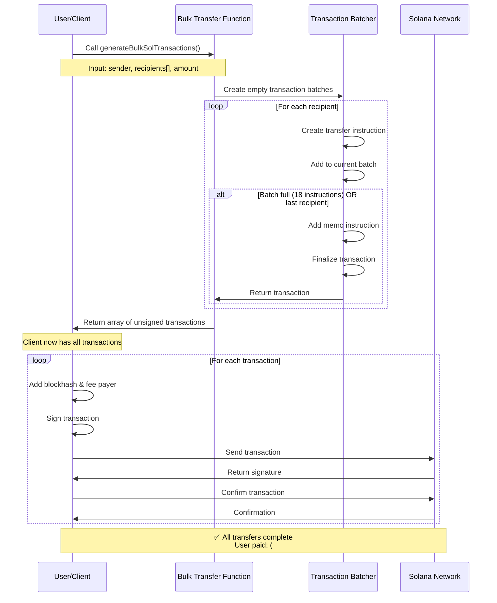
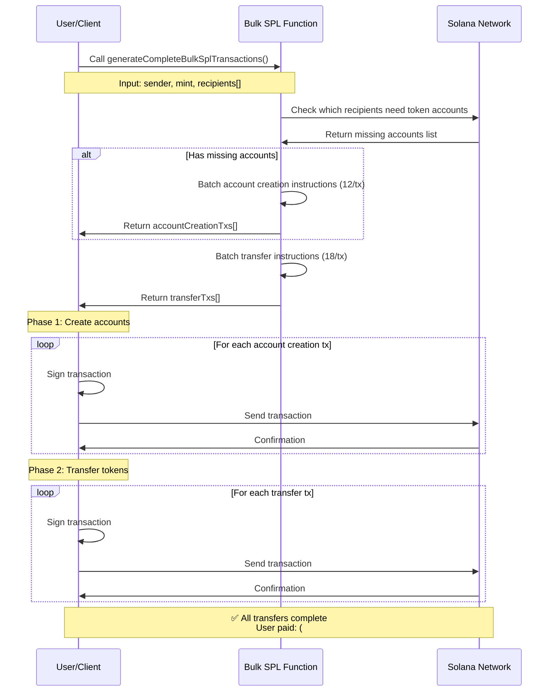
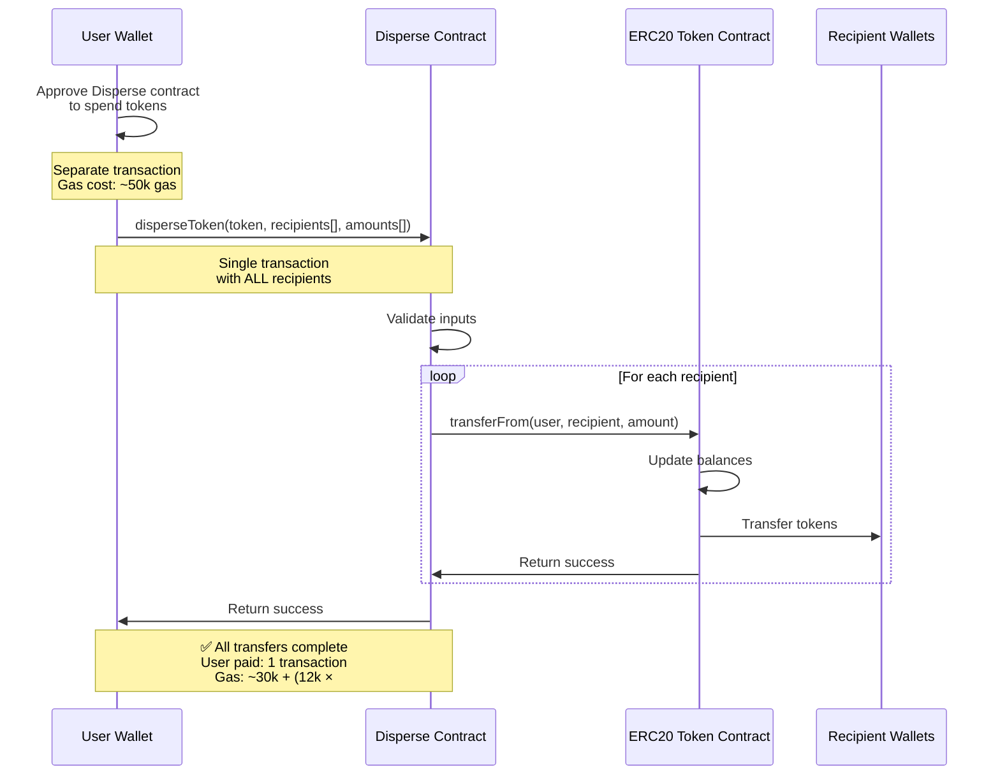

# Disperse Transfer Functions

Standalone functions for bulk sending SOL and SPL tokens on Solana. These functions are self-contained and can be used without importing the full soltoolkit-sdk library.

## Features

- ✅ **Bulk SOL transfers** - Send SOL to multiple recipients
- ✅ **Bulk SPL token transfers** - Send any SPL token to multiple recipients
- ✅ **Automatic transaction batching** - Optimally batches instructions into transactions
- ✅ **Token account creation** - Automatically creates associated token accounts if needed
- ✅ **Zero external dependencies** (except @solana/web3.js and @solana/spl-token)

## Installation

Copy the entire `bulk` directory to your project. You only need these dependencies:

```bash
npm install @solana/web3.js @solana/spl-token
```

## Quick Start

### Bulk SOL Transfer

```typescript
import { Connection, Keypair, PublicKey } from '@solana/web3.js';
import { generateBulkSolTransactions } from './bulk';

const connection = new Connection('https://api.devnet.solana.com');
const sender = Keypair.generate(); // Your keypair

// Generate transactions
const transactions = generateBulkSolTransactions({
  sender: sender.publicKey,
  recipients: [
    'recipient1PublicKey',
    'recipient2PublicKey',
    'recipient3PublicKey',
  ],
  fixedAmount: 1_000_000, // 0.001 SOL in lamports
  instructionsPerTx: 18, // Optional, default is 18
  memo: 'Bulk transfer', // Optional
});

// Sign and send transactions
for (const tx of transactions) {
  const { blockhash } = await connection.getLatestBlockhash();
  tx.recentBlockhash = blockhash;
  tx.feePayer = sender.publicKey;
  tx.sign(sender);

  const signature = await connection.sendRawTransaction(tx.serialize());
  await connection.confirmTransaction(signature);
  console.log('Transaction:', signature);
}
```

### Bulk SPL Token Transfer

```typescript
import { Connection, Keypair, PublicKey } from '@solana/web3.js';
import { generateCompleteBulkSplTransactions } from './bulk';

const connection = new Connection('https://api.devnet.solana.com');
const sender = Keypair.generate(); // Your keypair
const mint = new PublicKey('YourTokenMintAddress');

// Generate all necessary transactions
const { accountCreationTxs, transferTxs } = await generateCompleteBulkSplTransactions(
  connection,
  {
    sender: sender.publicKey,
    mint: mint,
    recipients: [
      'recipient1PublicKey',
      'recipient2PublicKey',
      'recipient3PublicKey',
    ],
    fixedAmount: 1_000_000, // Raw token amount (not decimal adjusted)
    instructionsPerTx: 18, // Optional
    memo: 'Bulk SPL transfer', // Optional
  }
);

// 1. First, create token accounts (if needed)
for (const tx of accountCreationTxs) {
  const { blockhash } = await connection.getLatestBlockhash();
  tx.recentBlockhash = blockhash;
  tx.feePayer = sender.publicKey;
  tx.sign(sender);

  const signature = await connection.sendRawTransaction(tx.serialize());
  await connection.confirmTransaction(signature);
  console.log('Account creation tx:', signature);
}

// 2. Then, send the tokens
for (const tx of transferTxs) {
  const { blockhash } = await connection.getLatestBlockhash();
  tx.recentBlockhash = blockhash;
  tx.feePayer = sender.publicKey;
  tx.sign(sender);

  const signature = await connection.sendRawTransaction(tx.serialize());
  await connection.confirmTransaction(signature);
  console.log('Transfer tx:', signature);
}
```

## API Reference

### SOL Transfers

#### `generateBulkSolTransactions(config: IBulkSolTransferConfig): Transaction[]`

Generates transactions for bulk SOL transfers.

**Config Options:**
- `sender: PublicKey` - The sender's public key
- `transfers?: ITransfer[]` - Array of { recipient, amount } for variable amounts
- `recipients?: string[]` - Array of recipient addresses (use with fixedAmount)
- `fixedAmount?: number` - Fixed amount in lamports to send to each recipient
- `instructionsPerTx?: number` - Instructions per transaction (default: 18)
- `memo?: string` - Optional memo text

**Returns:** Array of unsigned transactions

### SPL Token Transfers

#### `generateBulkSplTransactions(config: IBulkSplTransferConfig): Transaction[]`

Generates transactions for bulk SPL token transfers. **Note:** Assumes token accounts exist.

**Config Options:**
- `sender: PublicKey` - The sender's public key
- `mint: PublicKey` - The token mint address
- `transfers?: ITransfer[]` - Array of { recipient, amount } for variable amounts
- `recipients?: string[]` - Array of recipient addresses (use with fixedAmount)
- `fixedAmount?: number` - Fixed raw token amount to send to each recipient
- `instructionsPerTx?: number` - Instructions per transaction (default: 18)
- `memo?: string` - Optional memo text

**Returns:** Array of unsigned transactions

#### `generateTokenAccountCreationTransactions(connection, mint, payer, recipients, instructionsPerTx?): Promise<Transaction[]>`

Generates transactions to create associated token accounts for recipients who don't have them yet.

**Parameters:**
- `connection: Connection` - Solana connection
- `mint: PublicKey` - Token mint address
- `payer: PublicKey` - Account that pays for creation
- `recipients: string[]` - Array of recipient addresses
- `instructionsPerTx?: number` - Instructions per transaction (default: 12)

**Returns:** Array of unsigned transactions

#### `generateCompleteBulkSplTransactions(connection, config): Promise<{accountCreationTxs, transferTxs}>`

Complete workflow that generates both account creation and transfer transactions.

**Returns:** Object with `accountCreationTxs` and `transferTxs` arrays

## Usage Examples

### Variable Amounts

```typescript
// Different amounts for each recipient
const transactions = generateBulkSolTransactions({
  sender: sender.publicKey,
  transfers: [
    { recipient: 'address1', amount: 1_000_000 },
    { recipient: 'address2', amount: 2_000_000 },
    { recipient: 'address3', amount: 500_000 },
  ],
});
```

### Fixed Amount

```typescript
// Same amount for all recipients
const transactions = generateBulkSolTransactions({
  sender: sender.publicKey,
  recipients: ['address1', 'address2', 'address3'],
  fixedAmount: 1_000_000, // 0.001 SOL
});
```

## How It Works

1. **SOL Transfers**: Batches transfer instructions into transactions (default: 18 per tx)
2. **SPL Transfers**:
   - First checks if recipient token accounts exist
   - Creates missing accounts (batched, default: 12 per tx)
   - Then batches token transfer instructions (default: 18 per tx)
3. Each transaction batch includes a memo instruction for tracking

## Architecture & Flow

### Solana Bulk Transfer Flow (This Implementation)



### SPL Token Transfer Flow



### EVM Disperse.app Smart Contract Flow



## Solana vs EVM Disperse Comparison

### Architectural Differences

| Aspect | Solana (This Implementation) | EVM (Disperse.app) |
|--------|------------------------------|-------------------|
| **Execution Model** | Client-side transaction batching | Smart contract execution |
| **Smart Contract** | ❌ Not required | ✅ Required (deployed contract) |
| **Approval Step** | ❌ Not needed | ✅ Required for tokens (separate tx) |
| **Transaction Count** | Multiple (1 per ~18 recipients) | Single transaction for all |
| **Gas/Fee Model** | Fixed: ~5000 lamports per tx | Variable: ~30k + (12k × recipients) gas |
| **Signature Model** | User signs each transaction | User signs once |
| **Atomic Execution** | ❌ Not atomic (partial success possible) | ✅ Atomic (all or nothing) |
| **Failed Transfers** | Continue to next transaction | Entire transaction reverts |
| **Compute Limits** | Per-transaction (200k-1.4M CU) | Per-block gas limit (30M gas) |
| **Trust Model** | Zero trust (direct transfers) | Must trust smart contract |
| **Supply Chain Risk** | ✅ Minimal (no contract dependency) | ⚠️ Contract code risk |
| **Flexibility** | Instructions batched client-side | Logic fixed in contract |
| **Token Account Setup** | Must pre-create for SPL tokens | Not needed for ERC20 |

### Cost Comparison Example (1000 Recipients)

#### Solana (This Implementation)
```
SOL Transfers:
- Transactions needed: ⌈1000 ÷ 18⌉ = 56 transactions
- Cost: 56 × 0.000005 SOL = 0.00028 SOL (~$0.03 at $100/SOL)

SPL Token Transfers:
- Account creation: ⌈1000 ÷ 12⌉ = 84 transactions
  - Tx fees: 84 × 0.000005 SOL = 0.00042 SOL
  - Rent: 1000 × 0.00203928 SOL = 2.03928 SOL
- Token transfers: ⌈1000 ÷ 18⌉ = 56 transactions
  - Tx fees: 56 × 0.000005 SOL = 0.00028 SOL
- Total: ~2.04 SOL (~$204 at $100/SOL)

Note: Rent is recoverable when accounts are closed
```

#### EVM (Disperse.app)
```
Token Transfers:
- Approval: ~50,000 gas
- Disperse call: 30,000 + (12,000 × 1000) = 12,030,000 gas
- Total: ~12,080,000 gas
- Cost at 50 gwei: 0.604 ETH (~$1,812 at $3,000/ETH)
- Cost at 10 gwei: 0.121 ETH (~$363 at $3,000/ETH)

Note: Highly dependent on gas prices
```

### Key Architectural Insights

#### Why Solana Uses Client-Side Batching

1. **No Smart Contract Needed**: Solana's native programs (System Program, Token Program) handle transfers directly. No custom contract deployment required.

2. **Instruction Composition**: Solana transactions are composed of multiple instructions. Each instruction can be a transfer, making batching natural.

3. **Fixed Transaction Cost**: Unlike EVM's variable gas costs, Solana has predictable fees (~5000 lamports per transaction).

4. **Parallel Processing**: Multiple transactions can be processed in parallel by Solana validators, improving throughput.

5. **No Contract Risk**: Direct use of native programs eliminates smart contract vulnerabilities and supply chain risks.

#### Why EVM Uses Smart Contracts

1. **Single Transaction Model**: EVM transactions typically call a single contract function. To batch transfers, you need a contract with a loop.

2. **Gas Optimization**: A single contract call with a loop is more gas-efficient than multiple individual transactions.

3. **Atomicity**: Smart contract execution is atomic - either all transfers succeed or all fail, providing better guarantees.

4. **Token Approval Model**: ERC20 tokens require approval for third parties to transfer on your behalf, making contracts necessary.

### Trade-offs

#### Solana Approach Advantages
- ✅ No smart contract risk or supply chain concerns
- ✅ Predictable, low cost per transaction
- ✅ Partial success possible (if one tx fails, others can succeed)
- ✅ More flexible (can customize each transaction)
- ✅ No contract deployment or maintenance needed

#### Solana Approach Disadvantages
- ❌ Not atomic (partial failures possible)
- ❌ User must sign multiple transactions (or use a script)
- ❌ More RPC calls required
- ❌ SPL token accounts must be pre-created (costs rent)

#### EVM Approach Advantages
- ✅ Atomic execution (all or nothing)
- ✅ Single signature required
- ✅ More gas-efficient for large batches (at low gas prices)
- ✅ No token account setup needed

#### EVM Approach Disadvantages
- ❌ Requires deploying/trusting a smart contract
- ❌ High and variable gas costs
- ❌ Supply chain risk (contract vulnerabilities)
- ❌ All transfers fail if one fails
- ❌ Limited by block gas limit

### When to Use Each Approach

**Use Solana Client-Side Batching when:**
- You want zero smart contract risk
- You're okay with partial success scenarios
- You need predictable costs
- You're doing regular, repeated bulk transfers
- You can automate signing (e.g., backend service)

**Use EVM Smart Contract when:**
- You need atomic execution (all or nothing)
- You're doing one-time large distributions
- Gas prices are reasonable
- You need strict guarantees about execution
- You have a trusted, audited contract

## Transaction Limits

- **SOL transfers**: Up to 18 transfer instructions per transaction
- **Token account creation**: Up to 12 creation instructions per transaction
- **SPL transfers**: Up to 18 transfer instructions per transaction

These limits are conservative to ensure transactions don't exceed Solana's compute budget.

## Type Definitions

```typescript
interface ITransfer {
  recipient: string;
  amount: number; // lamports for SOL, raw amount for SPL
  associatedTokenAccount?: string;
}

interface IBulkSolTransferConfig {
  sender: PublicKey;
  transfers?: ITransfer[];
  recipients?: string[];
  fixedAmount?: number; // lamports
  instructionsPerTx?: number;
  memo?: string;
}

interface IBulkSplTransferConfig {
  sender: PublicKey;
  mint: PublicKey;
  transfers?: ITransfer[];
  recipients?: string[];
  fixedAmount?: number; // raw token amount
  instructionsPerTx?: number;
  memo?: string;
  decimals?: number;
}
```

## Security Considerations

- Always verify recipient addresses before sending
- Test with small amounts first on devnet
- Be aware of transaction fees (each transaction costs ~5000 lamports)
- Token account creation costs rent (~0.00203928 SOL per account)
- Consider rate limits when sending many transactions

## License

Extracted from soltoolkit-sdk. Use at your own risk.
